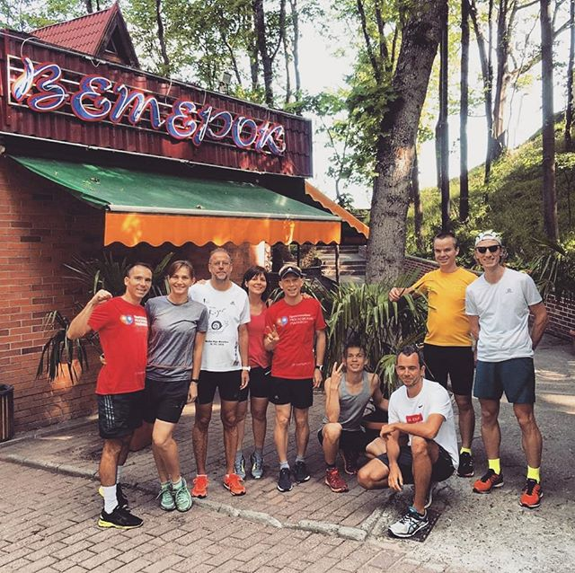

Пожалуй, самый известный спуск к морю в г. Светлогорск, это тот,
что идёт под крутым уклоном мимо кафе "Ветерок".
Именно там мы решили провести совместный забег под названием Ветерок-50.
Маршрут простой - 50 раз вверх, 49 раз вниз. Что в сумме даст ~28км протяженности
и +1400м набора высоты.

Утром мы собрались на летке "Ветерка". 
На столах расставили воду, гели, изотоники, бананы.
Для каждого участника был распечатан листок с числами от 1 до 50, на котором отмечалось кол-во пройденных
подъёмов. 

Погода радовала. На спусках дул встречный морской бриз. Температура +20С.
Примерно 2ч 30 мин понадобилось, чтобы сделать 50 забеганий.

p.s. благодарим кафе "Ветерок" за предоставленное место, а так же вкусную трапезу организованную
по окончании забега.
